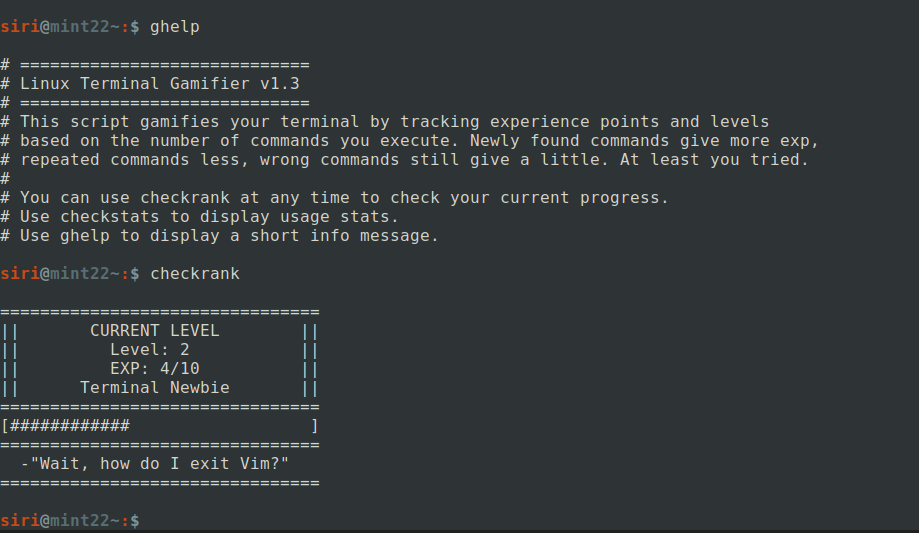

# Linux Terminal Gamifier




This script gamifies your terminal by tracking experience points and levels based on the number of commands you execute. Newly found commands give more EXP, repeated commands give less, and even incorrect commands still grant a small amount—at least you tried. Contains 14 unlockable ranks and 78 achievements. Supports bash and zsh shells.

## Setup for bash

1. Save this file in your home directory:
   ```bash
   curl --output ~/gamifier "https://raw.githubusercontent.com/Divinux/linux-terminal-gamifier/refs/heads/main/gamifier"
   ```
2. Source the file in your `.bashrc`. This can be done manually or by running:
   ```bash
   echo 'source ~/gamifier' >> ~/.bashrc
   ```
3. Ensure your history is reloaded after each command, then call `update_exp`. If you have not yet modified your `PROMPT_COMMAND`, you can simply run:
   ```bash
   echo 'export PROMPT_COMMAND="history -a; history -n; update_exp; $PROMPT_COMMAND"' >> ~/.bashrc
   ```
4. Restart your terminal or run:
   ```bash
   source ~/.bashrc
   ```

## Setup for zsh

1. Save this file in your home directory:
   ```bash
   curl --output ~/gamifier "https://raw.githubusercontent.com/Divinux/linux-terminal-gamifier/refs/heads/main/gamifier"
   ```
2. Source the file in your `.zshrc`. This can be done manually or by running:
   ```bash
   echo 'source ~/gamifier' >> ~/.zshrc
   ```
3. Ensure your history is reloaded after each command, then call `update_exp`. If you have not yet modified your `precmd` hook, you can simply run:
   ```bash
   echo -e "setopt incappendhistory\nprecmd() { update_exp; }" >> ~/.zshrc
   ```
4. Restart your terminal or run:
   ```bash
   source ~/.zshrc
   ```

## Additional Information

- This script creates a directory under `$XDG_DATA_HOME` (defaults to `~/.local/share/` if `$XDG_DATA_HOME` is not set) with four additional files:
  - `.exp`: Tracks the current experience amount and level.
  - `.usedcommands`: Contains all commands the user has used so far.
  - `.achievements`: Tracks the status of all achievements.
  - `.streak`: tracks the daily use streak.
- To continue tracking your progress on a new install, just copy this directory over.
- You may want to increase your `HISTSIZE` and `HISTFILESIZE`.
  - Setting them to nothing, i.e., `HISTSIZE=` and `HISTFILESIZE=`, makes them unlimited.
- Use `checkrank` at any time to check your current progress.
- Use `checkstats` to display usage stats.
- Use `ghelp` to display a short info message.
- Use `gupdate` to update Linux Terminal Gamifier.
- Use `gimport` to (re)import the history file.
- Found to work well with [bashcrawl](https://gitlab.com/slackermedia/bashcrawl), a terminal commands learning adventure game.
- Once the "New command discovered!" messages lose their novelty, they can be disabled by setting the notify_on_new variable in line 65 to false.
- Security consideration: The script pulls straight from your history file and saves to the .usedcommands file, so it will not contain anything that your history does not already contain anyways, just be aware that there is now a copy of your history saved somewhere else.

## FAQ

Q: The script stops working after installing OhMy*  
A: OhMy* overwrites the PROMPT_COMMAND, so either make sure to install OhMy* before the Gamifier script, or add `update_exp` to your PROMPT_COMMAND manually afterwards.

Q: The script doesn't notice me changing settings in it or in my .bashrc/.zshrc  
A: Sometimes just calling `source .bashrc` or `source .zshrc` isn't enough, refreshing the script explicitly with `source gamifier` usually solves this issue.

## Uninstall

1. Remove `source ~/gamifier` and `update_exp;` from your `.bashrc` for bash or  
   Remove `source ~/gamifier`, `setopt incappendhistory`, and `precmd() { update_exp; }` from your `.zshrc` for zsh.
2. Delete the `gamifier` file to remove the script.
3. Delete the `~/.local/share/gamifier` directory to remove your savefiles.
4. Restart your terminal.


